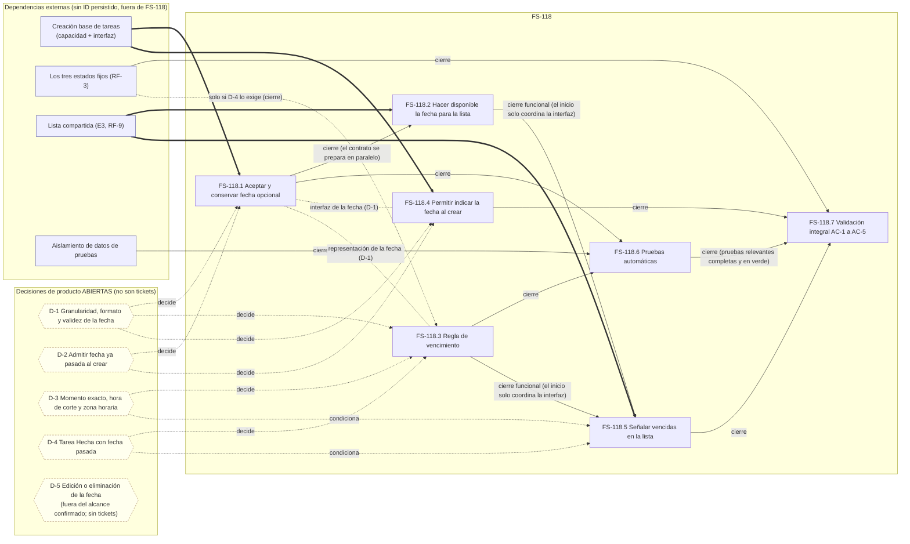

# FS-118 — Descomposición en tickets (planificación)

> **Estado:** PLANIFICACIÓN REVISADA (descomposición y grafo) · tallas y riesgos `[PROVISIONAL]` · no es un compromiso de entrega · sin horas · claves Jira solo en [`../README.md`](../README.md) §4.1 (Jira no es fuente de verdad).
> Última actualización: 2026-09-23. Etiquetas e identificadores: [`../README.md`](../README.md).
> Esta descomposición no modifica la historia ni sus criterios de aceptación: [`FS-118.md`](./FS-118.md) sigue siendo la fuente de AC-1 a AC-5.

## 1. Fuentes

- Historia y criterios de aceptación: [`FS-118.md`](./FS-118.md).
- Requisitos y decisiones: RF-2, RF-5, RF-6 y DP-2 en [`../../prd/flowsync-mvp.md`](../../prd/flowsync-mvp.md); alcance §4.2 en [`../../prd/alcance-mvp.md`](../../prd/alcance-mvp.md).
- Prioridad, secuencia entre historias y prerrequisitos externos: [`../priorizacion-mvp.md`](../priorizacion-mvp.md).
- Historia hermana: [`FS-142-descomposicion.md`](./FS-142-descomposicion.md).

## 2. Alcance de esta descomposición

- Los siete tickets cubren AC-1 a AC-5 de FS-118, sin cambiarlos.
- **No forman parte de FS-118:** la creación base de tareas, los tres estados fijos, la lista compartida (E3), la infraestructura externa de pruebas, y capacidades no aprobadas (avisos, edición de fecha, filtros adicionales, actualización sin refrescar).
- De esa lista, la creación base, los tres estados, la lista compartida y la infraestructura de pruebas son **dependencias externas** sin identificador persistido, definidas en [`../priorizacion-mvp.md`](../priorizacion-mvp.md), sección «Prerrequisitos externos». Las capacidades no aprobadas quedan fuera del alcance y no son dependencias.
- Las dependencias de cada ticket viven en el grafo (sección 5).

## 3. Tickets

Criterio de «terminado»: un ticket se cierra cuando cumple su propio DoD y se han satisfecho sus bloqueos de cierre documentados en el grafo (sección 5). Solo FS-118.7 declara validados los AC; el resto de tickets no declara ningún AC como validado.

### FS-118.1 — Aceptar y conservar una fecha de vencimiento opcional al crear una tarea

- **Tipo:** backend.
- **Objetivo y alcance:** que la creación de una tarea admita una fecha de vencimiento opcional, la conserve y siga funcionando sin ella. No incluye editar ni quitar la fecha. No incluye la regla de vencimiento.
- **AC a los que contribuye:** AC-1, AC-2.
- **Dependencias:**
  - Bloquea el inicio y el cierre: creación base de tareas (externa).
  - Decisiones abiertas: D-1, D-2 (sin ellas no está lista para implementar).
  - Coordina con: FS-118.4 (interfaz de la fecha) y FS-118.3 (representación de la fecha), ambas reguladas por D-1.
- **DoD:**
  - [ ] D-1 y D-2 resueltas y registradas antes de empezar.
  - [ ] `npm run lint` y `npm run typecheck` del backend pasan.
  - [ ] Si se tocan rutas o controladores, los tipos generados (`.adonisjs/`) se regeneran y se incluyen en el cambio.
  - [ ] Cambio revisado en PR sin regresión visible en la creación base.
  - [ ] Ningún AC se marca como satisfecho; se valida en FS-118.7.
- **Encaje en media jornada (condicional):** un atributo opcional sobre una capacidad de creación existente, sin regla temporal ni consulta. Depende de D-1, D-2 y de la forma que tenga la creación base.

### FS-118.2 — Hacer disponible la fecha (o su ausencia) para la lista

- **Tipo:** backend.
- **Objetivo y alcance:** que la información de cada tarea que consume la lista incluya su fecha cuando existe e indique su ausencia cuando no. No decide si una tarea está vencida.
- **AC a los que contribuye:** AC-3, AC-4, AC-5 (habilitador).
- **Dependencias:**
  - Bloquea el inicio y el cierre: la fuente de datos de la lista (E3, externa).
  - Bloquea solo el cierre: FS-118.1. FS-118.2 puede preparar en paralelo el contrato de lo que se expone; no se da por terminada mientras el atributo que expone no exista.
  - Coordina con: FS-118.1 (contrato) y FS-118.5 (qué recibe la lista).
- **DoD:**
  - [ ] `npm run lint` y `npm run typecheck` pasan.
  - [ ] Tipos generados actualizados si procede.
  - [ ] Revisado en PR.
  - [ ] Ningún AC se marca como satisfecho.
- **Encaje en media jornada (condicional):** solo amplía qué datos de la tarea se ofrecen a la lista.

### FS-118.3 — Regla de vencimiento

- **Tipo:** lógica de negocio. La capa (backend o frontend) es una decisión técnica pendiente, no de producto.
- **Objetivo y alcance:** determinar si una tarea con fecha está vencida y garantizar que una tarea sin fecha nunca lo está por fecha. No incluye edición de fecha ni avisos.
- **AC a los que contribuye:** AC-3, AC-4, AC-5.
- **Dependencias:**
  - Decisiones abiertas que la bloquean: D-1, D-3, D-4. No puede implementarse sin ellas.
  - No necesita que FS-118.1 esté terminado. Coordina con FS-118.1 (representación de la fecha, D-1) y con FS-118.5 (cómo se obtiene el resultado «vencida»).
  - Bloquea el cierre de: FS-118.5 y FS-118.6.
  - Estados (RF-3): condiciona el cierre solo si D-4 exige que la regla conozca el estado.
- **DoD:**
  - [ ] D-1, D-3 y D-4 resueltas y registradas antes de empezar.
  - [ ] La regla implementada coincide con lo decidido.
  - [ ] `npm run lint` y `npm run typecheck` pasan.
  - [ ] Revisado en PR.
  - [ ] Ningún AC se marca como satisfecho.
- **Encaje en media jornada (condicional):** una sola regla, siempre que las decisiones estén tomadas. No incluye interfaz ni persistencia.

### FS-118.4 — Permitir indicar la fecha opcional al crear una tarea

- **Tipo:** frontend.
- **Objetivo y alcance:** que en la creación de tarea el miembro pueda indicar la fecha de vencimiento opcionalmente, sin volverla obligatoria (RF-5). No decide diseño visual.
- **AC a los que contribuye:** AC-1, AC-2.
- **Dependencias:**
  - Bloquea el inicio y el cierre: interfaz de creación base (externa).
  - Decisiones abiertas: D-1 (cómo se indica la fecha) y D-2. Cómo se comporta el sistema ante un valor no válido sigue sin decidir.
  - Coordina con FS-118.1 (interfaz de la fecha). La integración con FS-118.1 se verifica en FS-118.7.
- **DoD:**
  - [ ] D-1 y D-2 resueltas y registradas antes de empezar.
  - [ ] `npm run build` (typecheck) y `npm run lint` pasan.
  - [ ] Formateo Prettier aplicado.
  - [ ] Revisado en PR.
  - [ ] Ningún AC se marca como satisfecho.
- **Encaje en media jornada (condicional):** una entrada opcional en una interfaz de creación que aún no existe.

### FS-118.5 — Señalar en la lista las tareas vencidas

- **Tipo:** frontend.
- **Objetivo y alcance:** que un miembro pueda identificar en la lista qué tareas están vencidas. No decide diseño visual y no operacionaliza «de un vistazo», que se descartó como AC (ver [`FS-118.md`](./FS-118.md)).
- **AC a los que contribuye:** AC-3, AC-4, AC-5.
- **Dependencias:**
  - Bloquea el inicio y el cierre: lista compartida (E3, externa).
  - Bloquea el cierre funcional: FS-118.2 y FS-118.3. La señalización funcional necesita la fecha (o su ausencia) que llega por FS-118.2 y el resultado de la regla de FS-118.3; no se da por cerrada contra datos simulados.
  - No bloquea el inicio: FS-118.2 y FS-118.3 solo se coordinan con este ticket (interfaz acordada). No se exige backend terminado para comenzar el frontend.
  - Decisiones abiertas que lo condicionan: D-3, D-4.
- **DoD:**
  - [ ] `npm run build` y `npm run lint` pasan.
  - [ ] Formateo Prettier aplicado.
  - [ ] Revisado en PR.
  - [ ] Ningún AC se marca como satisfecho.
- **Encaje en media jornada (condicional):** consume información resuelta por FS-118.2 y FS-118.3 y la refleja en una lista existente.

### FS-118.6 — Pruebas automáticas de la fecha opcional y de la regla de vencimiento

- **Tipo:** pruebas (backend).
- **Objetivo y alcance:** cubrir con pruebas automáticas la creación con y sin fecha, y la regla de vencimiento con fechas claramente pasadas, claramente futuras y ausentes. No prueba casos límite pendientes de decisión.
- **AC a los que contribuye:** AC-1 a AC-5, a nivel de capacidad y regla (no de interfaz).
- **Dependencias:**
  - Puede comenzar antes (test-first): no bloquea su inicio ninguna dependencia.
  - Bloquea el cierre: FS-118.1 y FS-118.3, porque las pruebas solo pasan cuando existe lo probado; y el aislamiento de datos de pruebas (externo), para la parte funcional. La prueba de la regla sola no lo necesita.
  - Decisiones abiertas que condicionan los casos: D-2, D-3, D-4.
- **DoD:**
  - [ ] Existe una prueba por cada AC al que contribuye.
  - [ ] Las pruebas se ejecutan con `npm test` y pasan.
  - [ ] Los datos de prueba quedan aislados del servidor de desarrollo (las suites functional comparten hoy la base de datos con él, según `CLAUDE.md`).
  - [ ] Revisado en PR.
- **Encaje en media jornada (condicional):** una sola batería enfocada en casos claros.

### FS-118.7 — Validación de comportamiento integral contra AC-1 a AC-5

- **Tipo:** integración y validación.
- **Objetivo y alcance:** comprobar de extremo a extremo cada AC con la lista real, registrando el resultado por AC con evidencia. Es el único ticket que puede declarar un AC validado.
- **AC a los que contribuye:** AC-1 a AC-5.
- **Dependencias:**
  - Puede comenzar antes: preparar escenarios y datos, y verificar lo ya disponible.
  - Bloquea el cierre: FS-118.4, FS-118.5 y FS-118.6 (las pruebas automatizadas relevantes deben estar completas y en verde), y la existencia de los tres estados. La creación base y la lista de E3 lo condicionan de forma transitiva.
  - Decisiones abiertas que condicionan los casos límite: D-2, D-3, D-4.
- **DoD (comportamiento validado):**
  - [ ] Cada AC verificado con un escenario observable y evidencia registrada.
  - [ ] Usa fechas claramente pasadas, futuras y ausentes.
  - [ ] Los AC no verificables por depender de una decisión abierta quedan marcados como no validados, no como satisfechos.
  - [ ] Como el frontend no tiene runner de tests, la verificación de interfaz es manual y así se registra.
- **Encaje en media jornada (condicional):** cinco escenarios acotados con datos preparados. El tamaño no incluye los defectos que se descubran; esos van a los tickets afectados.

## 4. Notas de contingencia de tamaño (no son tickets)

Posibles divisiones si algún ticket supera la media jornada. No se crean tickets ni identificadores, y no añaden alcance.

- **FS-118.1:** si la validación de formato (D-1) resulta compleja, separar «aceptar y conservar la fecha» de «validar la fecha según el formato decidido».
- **FS-118.3:** si D-3 exige zona horaria por persona u hora de corte, separar la regla base del tratamiento temporal decidido.
- **FS-118.4:** si no existe una interfaz de creación base, esa interfaz no es alcance de FS-118; hay que reordenar dependencias, sin añadirla aquí. Si además hace falta un control de fecha nuevo, el ticket podría crecer.
- **FS-118.5:** si la lista de E3 no ofrece lo necesario, separar «identificar las tareas vencidas» (AC-3) de «no identificar como vencidas las tareas con plazo vigente ni las que no tienen fecha» (AC-4 y AC-5). AC-5 exige no identificarlas falsamente como vencidas; no exige una marca visual específica para ellas. Sin añadir comportamiento ni cambiar el alcance.
- **FS-118.6:** si hay que preparar el aislamiento de datos dentro del ticket, separar «preparar el aislamiento y el esqueleto de pruebas» de «escribir las pruebas de los AC».
- **FS-118.7:** separar la validación de creación (AC-1, AC-2) de la de identificación (AC-3, AC-4, AC-5).

## 5. Grafo de dependencias

**Semántica.** Una flecha continua `A → B` significa que A bloquea realmente la finalización correcta de B. Aquí «finalización correcta» es cumplir el DoD del propio ticket y sus bloqueos de cierre documentados en este grafo; el comportamiento integrado solo se valida en FS-118.7. Cada arista indica si bloquea el **inicio** o solo el **cierre**. Una línea punteada sin flecha es **coordinación** (avanzan en paralelo acordando una interfaz o un comportamiento). Un hexágono es una **decisión de producto abierta**; no es un ticket. Solo se dibujan las aristas no transitivas.

### 5.1 Aristas de bloqueo

| Origen → Destino | Inicio | Cierre | Justificación verificable |
|---|---|---|---|
| Creación base → FS-118.1 | sí | sí | FS-118.1 añade un atributo opcional a la creación; sin creación no hay dónde añadirlo. El repo no tiene ningún concepto de tarea. |
| Creación base → FS-118.4 | sí | sí | La entrada de fecha se añade a la interfaz de creación base (alcance de FS-118.4). |
| Lista (E3) → FS-118.2 | sí | sí | FS-118.2 modifica la información que consume la lista; sin esa fuente no hay nada que modificar. |
| Lista (E3) → FS-118.5 | sí | sí | FS-118.5 señala en la lista; sin lista no hay dónde señalar. |
| FS-118.1 → FS-118.2 | no | sí | FS-118.2 puede preparar el contrato en paralelo; no puede darse por terminada mientras el atributo que expone (introducido por FS-118.1) no exista. |
| FS-118.2 → FS-118.5 | no | sí | Cierre funcional: la señalización real necesita la fecha o su ausencia que llega por FS-118.2 (AC-3, AC-4 y AC-5 dependen de distinguir con y sin fecha). El inicio solo coordina la interfaz. |
| FS-118.3 → FS-118.5 | no | sí | Cierre funcional: necesita el resultado de la regla. El inicio solo coordina cómo se obtiene. Dónde reside la regla es una decisión técnica sin tomar, y eso no es bloqueo. |
| FS-118.1 → FS-118.6 | no | sí | Las pruebas pueden escribirse antes, pero solo pasan cuando existe lo probado. |
| FS-118.3 → FS-118.6 | no | sí | Ídem para la regla. |
| Aislamiento → FS-118.6 | no | sí (parte funcional) | Los tests functional comparten base de datos con el servidor de desarrollo (`CLAUDE.md`). La prueba de la regla sola no lo necesita. |
| FS-118.4 → FS-118.7 | no | sí | La validación integral necesita la entrada de fecha en la creación (AC-1, AC-2). |
| FS-118.5 → FS-118.7 | no | sí | Necesita la señalización en la lista (AC-3, AC-4, AC-5). |
| FS-118.6 → FS-118.7 | no | sí | La validación integral no se considera terminada mientras falten o fallen las pruebas automatizadas relevantes. FS-118.7 sí puede comenzar antes. |
| Estados (RF-3) → FS-118.7 | no | sí | Los escenarios crean tareas «con su estado». |
| Estados (RF-3) → FS-118.3 | no | solo si D-4 lo exige | Si una tarea Hecha se trata de forma distinta, la regla debe conocer el estado. |

Las aristas FS-118.2 → FS-118.7 y FS-118.3 → FS-118.7 no se dibujan: son transitivas por FS-118.5 → FS-118.7 (y, para FS-118.3, también por FS-118.6).

### 5.2 Coordinaciones que no son bloqueos

- **FS-118.1 ⇄ FS-118.4:** acuerdan qué se indica y cómo se trata un valor no válido, regido por D-1 y D-2. Cada capa avanza en paralelo; la integración se verifica en FS-118.7.
- **FS-118.1 ⇄ FS-118.3:** comparten la representación de la fecha (D-1). La regla no necesita que FS-118.1 esté terminado.
- **FS-118.1 ⇄ FS-118.2:** acuerdan el contrato de lo que se expone; FS-118.2 lo prepara sin esperar.
- **FS-118.2 ⇄ FS-118.5:** acuerdan qué recibe la lista (la fecha o su ausencia).
- **FS-118.3 ⇄ FS-118.5:** acuerdan cómo se obtiene el resultado «vencida».
- **Sin relación entre sí:** FS-118.2 y FS-118.3; FS-118.4 y FS-118.5; FS-118.4 y FS-118.6 (más allá de los cierres indicados).

### 5.3 Dependencias externas

Definiciones en [`../priorizacion-mvp.md`](../priorizacion-mvp.md), sección «Prerrequisitos externos». Ninguna forma parte de FS-118 ni tiene identificador persistido.

| Dependencia externa | Afecta a |
|---|---|
| Creación base de tareas (capacidad e interfaz) | FS-118.1 (inicio y cierre) y FS-118.4 (inicio y cierre); FS-118.7 de forma transitiva |
| Los tres estados fijos (RF-3) | FS-118.7 (cierre); FS-118.3 solo si D-4 lo exige |
| Lista compartida (E3, RF-9) | FS-118.2 y FS-118.5 (inicio y cierre); FS-118.7 de forma transitiva |
| Aislamiento de datos de pruebas | FS-118.6 (cierre, parte funcional) |

## 6. Decisiones abiertas `[DECISIÓN ABIERTA]`

Las ocho ambigüedades documentadas en [`FS-118.md`](./FS-118.md), agrupadas por etiquetas de planificación. Ninguna se resuelve en este documento; las decide una persona.

| Decisión | Ambigüedad de FS-118.md (literal) | Bloquea | Condiciona |
|---|---|---|---|
| **D-1** | «Granularidad de la fecha.» | FS-118.1, FS-118.3, FS-118.4 | — |
| **D-1** | «Formato y validez de la fecha.» (incluye cómo se trata un valor no válido) | FS-118.1, FS-118.4 | — |
| **D-2** | «Si se permite o no indicar una fecha de vencimiento ya pasada al crear la tarea.» | FS-118.1, FS-118.4 | FS-118.6 y FS-118.7: si se rechaza, una tarea con fecha pasada solo se obtiene con datos preparados o con el paso del tiempo. |
| **D-3** | «Momento exacto en que una fecha pasa a estar vencida.» | FS-118.3 | FS-118.5, FS-118.6 y FS-118.7 (casos límite) |
| **D-3** | «Hora de corte.» | FS-118.3 | FS-118.5, FS-118.6 y FS-118.7 |
| **D-3** | «Zona horaria.» | FS-118.3 | FS-118.5, FS-118.6 y FS-118.7 |
| **D-4** | «Comportamiento de una tarea en estado Hecha cuya fecha de vencimiento ya ha pasado.» | FS-118.3 | FS-118.5, FS-118.6 y FS-118.7 |
| **D-5** | «Edición o eliminación de la fecha de vencimiento después de crear la tarea.» | — | — |

- **D-5** permanece fuera del alcance confirmado. No genera tickets, aristas ni trabajo en esta descomposición.
- AC-2 y AC-5 (sin fecha) no dependen de D-3 ni de D-4.
- PA-4 (quién es «miembro») se hereda a través de la creación base; PA-2 y PA-3 no afectan a FS-118.

## 7. Estimaciones preliminares `[PROVISIONAL]`

**Advertencia:** son estimaciones preliminares, **no compromisos de entrega**. Miden **solo el trabajo propio del ticket**, no sus dependencias externas ni la incertidumbre por decisiones abiertas, que van en riesgo y confianza. No hay horas ni puntos de historia.

**Escala** (relativa a la regla de media jornada): **S** entra holgadamente. **M** ocupa aproximadamente la media jornada, sin margen. **L** previsiblemente la supera.

### 7.1 Tallas por ticket

| Ticket | Talla | Riesgo | Confianza | Justificación | Factores de cambio |
|---|---|---|---|---|---|
| FS-118.1 | S (provisional) | MEDIO | BAJA | Añadir un atributo opcional sigue un flujo ya usado en el repo. No se asume esquema ni nullability. Sin regla temporal ni consulta. | Sube a M si D-1 exige validación de formato y granularidad no trivial. También cambia según la forma de la creación base, que no existe. |
| FS-118.2 | S | MEDIO | MEDIA | Solo amplía qué datos de la tarea se ofrecen a la lista. Sin lógica de vencimiento. | Depende de cómo sea la fuente de la lista de E3, hoy inexistente. |
| FS-118.3 | M (provisional) | ALTO | BAJA | El ticket entero es lógica temporal. Incluso la variante más simple exige manejar bien el corte del día. Se asume una variante neutra. | Sube a L si D-3 exige zona horaria por persona u hora de corte. Baja a S si D-3 y D-4 se resuelven de forma simple. |
| FS-118.4 | S | MEDIO | BAJA | Es una entrada opcional en una interfaz de creación que aún no existe, sobre primitivas ya disponibles. | Sube a M si hace falta un control de fecha nuevo (no hay selector de fecha), o si D-1 y D-2 imponen validación con retroalimentación. |
| FS-118.5 | S | MEDIO | BAJA | Refleja resultados que llegan de FS-118.2 y FS-118.3 en una lista existente. Sin diseño visual decidido. | Sube a M si la lista de E3 no ofrece dónde señalar o exige rehacer su presentación. Condicionado por D-3 y D-4. |
| FS-118.6 | M | MEDIO | MEDIA | Son las primeras pruebas del repositorio, con cinco AC entre creación y regla, usando fechas claramente pasadas, futuras y ausentes. | Sube a L si el aislamiento de datos hay que prepararlo dentro del ticket. Baja a S si ya existe y hay un patrón de pruebas. |
| FS-118.7 | S | ALTO | MEDIA | Cinco escenarios con datos preparados y evidencia registrada; el frontend no tiene runner, así que la parte de interfaz es manual. El tamaño no incluye los defectos que se descubran. | Sube a M según cuánto cueste obtener datos con fecha pasada (D-2). Los defectos que aparezcan van a los tickets afectados. |

### 7.2 Los cuatro ejes por separado

| Ticket | Tamaño propio | Riesgo de integración | Bloqueos externos | Incertidumbre por decisiones |
|---|---|---|---|---|
| FS-118.1 | S | con la creación y FS-118.4 | creación base | D-1, D-2 |
| FS-118.2 | S | con la fuente de la lista | lista de E3 | indirecta (D-1) |
| FS-118.3 | M | con FS-118.5 y FS-118.6 | estados, solo si D-4 lo exige | D-1, D-3, D-4 |
| FS-118.4 | S | con FS-118.1 | interfaz de creación | D-1, D-2 |
| FS-118.5 | S | con FS-118.2, FS-118.3 y la lista | lista de E3 | D-3, D-4 |
| FS-118.6 | M | con FS-118.1 y FS-118.3 | aislamiento de pruebas | D-2, D-3, D-4 (casos) |
| FS-118.7 | S | el más alto: integra todo | estados, lista, creación base | D-2, D-3, D-4 |

### 7.3 Capacidades reales del repositorio consideradas (commit `401195a`)

- **Existe:** un backend con flujo de migración, validación y transformación de salida; Japa configurado con las suites unit y functional y los plugins de cliente de API y de autenticación; un frontend con las primitivas `Input`, `Label`, `Alert`, `Card` y `Button`, y con `npm run build` (typecheck) y `npm run lint`.
- **No existe:** ningún concepto de tarea, estado ni lista; ningún fichero de prueba (`tests/unit` y `tests/functional` no existen); ningún selector de fecha ni librería de fechas en el frontend; ningún runner de pruebas en el frontend.
- **Aislamiento:** las suites functional usan el mismo fichero de base de datos que el servidor de desarrollo.

### 7.4 Limitaciones de la estimación

- Ninguna estimación alcanza confianza ALTA: todos los tickets dependen de una externa aún no construida o de una decisión abierta.
- **Optimismo:** no se descuenta tiempo por generación asistida, que ayuda con lo mecánico pero no con decisiones, revisión, integración ni validación manual. Se estima sin ver la creación base ni la lista, lo que sesga hacia el optimismo.
- **Integración subestimada:** las tallas excluyen la integración, que se concentra en FS-118.7 con riesgo ALTO. Los defectos que aparezcan allí no están sumados a ningún ticket.
- **Pruebas:** FS-118.6 cubre solo backend, que es hoy la única capa con infraestructura de pruebas. La ubicación de la regla de FS-118.3 (backend o frontend) sigue siendo una decisión técnica abierta que este documento no toma. Si la regla reside en el backend, FS-118.6 la cubre. Si residiera en el frontend, su verificación automática quedaría fuera de FS-118.6 (no hay runner y añadirlo no está aprobado), y una comprobación manual en FS-118.7 no sustituye la cobertura automática que FS-118.6 exige para cerrarse: el DoD y el plan de verificación requerirían revisión humana antes de declarar completada la historia. La interfaz de AC-3, AC-4 y AC-5 solo se verifica a mano en FS-118.7.
- **Decisiones abiertas:** las tallas de FS-118.1, FS-118.3, FS-118.4 y FS-118.5 son provisionales y cambian con D-1 a D-4.
- **Verificaciones pendientes:** releer la creación base y la lista cuando existan y reconfirmar FS-118.1, FS-118.2, FS-118.4 y FS-118.5; confirmar el enfoque de aislamiento de pruebas antes de fijar FS-118.6.

## 8. Matriz de trazabilidad

### 8.1 Ticket → AC, dependencias, decisiones y estimación

| Ticket | AC | Bloquea el inicio | Bloquea el cierre | Coordina con | Decisiones | Talla · Riesgo · Confianza `[PROVISIONAL]` |
|---|---|---|---|---|---|---|
| FS-118.1 | AC-1, AC-2 | creación base | creación base | FS-118.2, FS-118.3, FS-118.4 | D-1, D-2 | S · MEDIO · BAJA |
| FS-118.2 | AC-3, AC-4, AC-5 (habilitador) | lista (E3) | lista (E3), FS-118.1 | FS-118.1, FS-118.5 | (vía D-1) | S · MEDIO · MEDIA |
| FS-118.3 | AC-3, AC-4, AC-5 | — (decisiones) | estados, solo si D-4 lo exige | FS-118.1, FS-118.5 | D-1, D-3, D-4 | M · ALTO · BAJA |
| FS-118.4 | AC-1, AC-2 | creación base (interfaz) | creación base (interfaz) | FS-118.1 | D-1, D-2 | S · MEDIO · BAJA |
| FS-118.5 | AC-3, AC-4, AC-5 | lista (E3) | lista (E3), FS-118.2, FS-118.3 | FS-118.2, FS-118.3 | D-3, D-4 (condicionan) | S · MEDIO · BAJA |
| FS-118.6 | AC-1 a AC-5 (capacidad y regla) | — (test-first) | FS-118.1, FS-118.3, aislamiento | — | D-2, D-3, D-4 (casos) | M · MEDIO · MEDIA |
| FS-118.7 | AC-1 a AC-5 (validación) | — | FS-118.4, FS-118.5, FS-118.6, estados | — | D-2, D-3, D-4 | S · ALTO · MEDIA |

### 8.2 AC → tickets

| AC | Tickets que permiten satisfacerlo | Solo se declara validado en |
|---|---|---|
| AC-1 | FS-118.1, FS-118.4, FS-118.6 | FS-118.7 |
| AC-2 | FS-118.1, FS-118.4, FS-118.6 | FS-118.7 |
| AC-3 | FS-118.2, FS-118.3, FS-118.5, FS-118.6 | FS-118.7 |
| AC-4 | FS-118.2, FS-118.3, FS-118.5, FS-118.6 | FS-118.7 |
| AC-5 | FS-118.2, FS-118.3, FS-118.5, FS-118.6 | FS-118.7 |

Terminar un ticket es trabajo técnico completado, no comportamiento validado.

## 9. Notas de planificación

### 9.1 Cadena de dependencias candidata a camino crítico

Sin duraciones no puede determinarse el camino crítico temporal. Por número de tickets encadenados en aristas de bloqueo, la cadena más larga es **[creación base + D-1 + D-2] → FS-118.1 → FS-118.2 → FS-118.5 → FS-118.7** (con la lista de E3 entrando en FS-118.2 y FS-118.5). Como candidata alternativa, dependiente de decisión humana: **[D-3 + D-4] → FS-118.3 → FS-118.5 → FS-118.7**. Cuál domina depende de duraciones que no se estiman aquí.

### 9.2 Cuándo puede empezar y cuándo puede cerrarse cada ticket

| Ticket | Puede empezar cuando | Puede cerrarse cuando |
|---|---|---|
| FS-118.1 | Existe la creación base y están resueltas D-1 y D-2. | Además, se coordina con FS-118.4. |
| FS-118.2 | Existe la fuente de la lista y hay contrato acordado con FS-118.1 (no espera a que termine). | Ha cerrado FS-118.1. |
| FS-118.3 | Están resueltas D-1, D-3 y D-4. | Además, los estados existen si D-4 lo exige. |
| FS-118.4 | Existe la interfaz de creación base y están resueltas D-1 y D-2; se coordina con FS-118.1. | Ídem. |
| FS-118.5 | Existe la lista y hay interfaz acordada con FS-118.2 y FS-118.3 (no necesita que estén terminadas). | Han cerrado FS-118.2 y FS-118.3, con la fecha o su ausencia y el resultado de la regla reales. |
| FS-118.6 | Puede empezar test-first: ninguna dependencia bloquea su inicio; los casos que dependen de D-2, D-3 y D-4 esperan a esas decisiones. | Han cerrado FS-118.1 y FS-118.3, y existe el aislamiento de pruebas (parte funcional). |
| FS-118.7 | Puede empezar: preparar escenarios y datos, y verificar lo ya disponible. | Han cerrado FS-118.4, FS-118.5 y FS-118.6 (pruebas relevantes completas y en verde), con los estados existentes. |

### 9.3 Orden de ejecución (conveniencia, no bloqueo)

- **Una persona:** FS-118.1 → FS-118.3 → FS-118.6 → FS-118.4 → FS-118.2 → FS-118.5 → FS-118.7. FS-118.7 puede preparar escenarios desde el principio, pero se cierra al final.
- **Varias personas:** con las externas disponibles y las decisiones D-1 a D-4 resueltas, pueden empezar en paralelo FS-118.1, FS-118.2, FS-118.3, FS-118.4, FS-118.5, FS-118.6 (test-first) y la preparación de FS-118.7. Lo que difiere son los cierres, en la secuencia de la tabla anterior.

### 9.4 Evidencia de AC-1

AC-1 exige que la tarea «quede creada con esa fecha». Cómo se recoge esa evidencia en FS-118.7 (por ejemplo, la comprobación automática de FS-118.6 a nivel de capacidad, u otra verificación registrada por quien valide) es una **necesidad de evidencia de validación**, no una funcionalidad nueva. No implica mostrar la fecha a los miembros, no es una decisión de producto y no genera un ticket.
