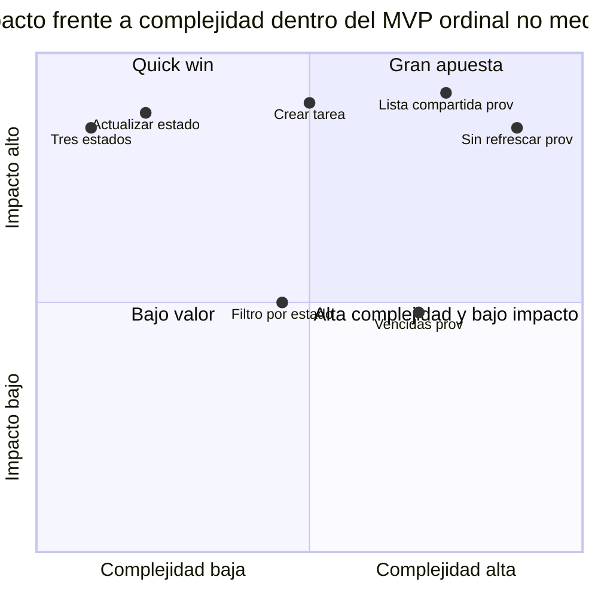
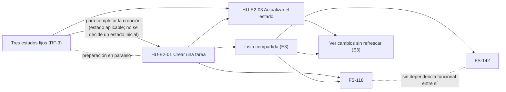

# Priorización del MVP — impacto, complejidad, prioridad de negocio y secuencia técnica

> **Estado:** PLANIFICACIÓN REVISADA · impacto, complejidad y secuencia `[PROVISIONAL]` · no es un compromiso de entrega · sin horas · sin Jira.
> Última actualización: 2026-09-23. Etiquetas e identificadores: [`README.md`](./README.md).
> El PRD determina el alcance aprobado ([`../prd/flowsync-mvp.md`](../prd/flowsync-mvp.md), [`../prd/alcance-mvp.md`](../prd/alcance-mvp.md)). Este documento no añade historias, criterios de aceptación ni decisiones de producto.

## 1. Criterios

- **Impacto** (ALTO / MEDIO / BAJO): cuánto contribuye a validar la hipótesis principal del MVP, que la visibilidad compartida de en qué trabaja cada persona puede sustituir la ronda de status. Se justifica por el beneficio para el usuario y la validación del producto, no por la facilidad de implementación.
- **Complejidad** (BAJA / MEDIA / ALTA, o `INFORMACIÓN INSUFICIENTE` si no hay base para fijar un nivel): considera cantidad de comportamiento, dependencias, integración entre capacidades, incertidumbre y decisiones abiertas. No presupone un diseño técnico. `PROVISIONAL` no es un nivel de complejidad: es una etiqueta de estado (ver [`README.md`](./README.md)) que indica que una clasificación puede cambiar con información nueva.
- **Tendencia provisional:** cuando la complejidad es `INFORMACIÓN INSUFICIENTE`, se anota aparte una tendencia orientativa (por ejemplo, ALTA). No fija un nivel de complejidad.
- **Confianza** (ALTA / MEDIA / BAJA): confianza en la clasificación; se indica qué información falta cuando corresponde. Es una escala distinta de la confianza de las estimaciones por ticket de [`E2-gestion-tareas/FS-118-descomposicion.md`](./E2-gestion-tareas/FS-118-descomposicion.md), que evalúan otro nivel (ticket frente a historia).
- **Tipo:** `habilitadora` (prerrequisito de lo observable; no se entrega como valor independiente), `historia de valor` o `pilar de valor`.
- **Clasificación:** QUICK WIN (impacto alto y complejidad baja), GRAN APUESTA (impacto alto y complejidad media o alta), INTERMEDIA, BAJO VALOR, FUERA DE MVP / ICEBOX.
- Las capacidades ya existentes de E1 (cuentas: registro, inicio y cierre de sesión, perfil) se reutilizan y no forman parte de este backlog.

## 2. Dentro del MVP

| Historia / capacidad | Tipo | Épica | Alcance | Impacto | Complejidad | Tendencia provisional | Confianza | Punto abierto | Clasificación | Justificación |
|---|---|---|---|---|---|---|---|---|---|---|
| **Tres estados fijos** (RF-3, DP-1) | habilitadora | E2 | DENTRO DEL MVP | ALTO | BAJA | — | MEDIA | Ninguno (DP-1 cerrado) | QUICK WIN | Sin estados no se puede expresar «en qué está cada uno». Comportamiento mínimo. Regla transversal sin historia propia: no tiene valor observable por sí sola y se entrega junto con la creación y el cambio de estado. |
| **HU-E2-03** Actualizar manualmente el estado (RF-4) | historia de valor | E2 | DENTRO DEL MVP | ALTO | BAJA | — | MEDIA | Ninguno para el estado (PA-2 solo afecta a reasignar) | QUICK WIN | Es el hábito sobre el que descansa el riesgo principal y la única fuente de información del tablero. Una sola acción sobre tres valores fijos. Historia no persistida y sin AC. |
| **HU-E2-01** Crear una tarea (RF-2 núcleo, RF-5) | habilitadora | E2 | DENTRO DEL MVP | ALTO | MEDIA | — | BAJA | PA-4 (quién puede ser responsable); estado inicial y obligatoriedad del título sin definir | GRAN APUESTA | Sin tareas no hay visibilidad; la baja fricción sostiene la hipótesis de mantener el estado. Comportamiento acotado, pero parte de cero, sin creación en el repo. Historia no persistida, sin AC ni estimación. |
| **FS-142** Filtrar por estado (RF-7) | historia de valor | E2 | DENTRO DEL MVP | MEDIO | MEDIA | — | MEDIA | Los cinco pendientes de FS-142 | INTERMEDIA | Ayuda a centrarse (por ejemplo, ver qué está En progreso), pero el núcleo del piloto funciona sin filtro con equipos pequeños. Comportamiento acotado (5 AC), con dependencias externas de todos los prerrequisitos. |
| **FS-118** Fecha opcional e identificar vencidas (RF-2, RF-6) | historia de valor | E2 | DENTRO DEL MVP | MEDIO (provisional) | INFORMACIÓN INSUFICIENTE | MEDIA-ALTA | BAJA | Las ocho ambigüedades (D-1 a D-5) | INTERMEDIA (provisional) | Ver la nota siguiente. Su complejidad depende de semántica temporal sin decidir. |
| **Lista compartida** (RF-8, RF-9, RF-10) | habilitadora | E3 | DENTRO DEL MVP | ALTO | INFORMACIÓN INSUFICIENTE | ALTA | BAJA | PA-4 | GRAN APUESTA (provisional) | Es la superficie donde todo se hace visible; nada observable existe sin ella. Sin historia, AC ni estimación. |
| **Ver cambios de estado sin refrescar** (RF-11) | pilar de valor | E3 | DENTRO DEL MVP | ALTO | INFORMACIÓN INSUFICIENTE | ALTA | BAJA | PA-4; latencia y observable sin definir | GRAN APUESTA (provisional) | Es el objeto de una de las dos hipótesis de producto del PRD (§4.5) y parte de la propuesta de valor («tiempo real»). Implica varias personas, la lista y el cambio de estado juntos, y el repo no tiene nada equivalente. Sin historia ni AC. |

**Nota sobre el impacto de FS-118.** El impacto MEDIO es una **clasificación provisional**, no una decisión de producto.

- **A favor de un impacto mayor:** identificar qué tareas están vencidas es la mitad explícita de la propuesta de valor del MVP («qué se ha pasado de plazo») y da utilidad directa al miembro cuando mira el trabajo del equipo.
- **Limitación:** ni el problema (§1 del PRD) ni el criterio de éxito del piloto miden esa capacidad. La métrica principal es eliminar la ronda de status, a la que las fechas contribuyen solo de forma indirecta. Además, la fecha es opcional.
- **Qué la cambiaría:** si la propuesta de valor completa, y no solo la hipótesis del piloto, fuera el criterio de éxito, el impacto podría revisarse al alza. Eso corresponde a una persona.

## 3. Fuera del MVP explícito (PRD §4.4)

El impacto se valora solo a modo informativo y **no reabre ninguna exclusión**. La complejidad es `INFORMACIÓN INSUFICIENTE` en todos: no hay historia ni alcance definido.

| Candidata | Épica | Alcance | Impacto (informativo) | Complejidad | Confianza | Clasificación | Justificación |
|---|---|---|---|---|---|---|---|
| Estado «Bloqueada» y configuración de estados (DP-1) | E2 | FUERA DEL MVP EXPLÍCITO | BAJO | INFORMACIÓN INSUFICIENTE | MEDIA | FUERA DE MVP / ICEBOX | La hipótesis no lo necesita; los bloqueos pueden seguir hablándose en la daily. |
| Comentarios en tareas | E2 | FUERA DEL MVP EXPLÍCITO | BAJO | INFORMACIÓN INSUFICIENTE | MEDIA | FUERA DE MVP / ICEBOX | No es necesario para saber quién está en qué. |
| Estimaciones y atributos adicionales de tarea | E2 | FUERA DEL MVP EXPLÍCITO | BAJO | INFORMACIÓN INSUFICIENTE | MEDIA | FUERA DE MVP / ICEBOX | Contradice la baja fricción. |
| Inferir el estado automáticamente | E2 | FUERA DEL MVP EXPLÍCITO | BAJO | INFORMACIÓN INSUFICIENTE | MEDIA | FUERA DE MVP / ICEBOX | Cambiaría lo que se valida: el MVP prueba precisamente el mantenimiento manual del estado. |
| Notificaciones push (incluye avisos de vencimiento por push) | E3 | FUERA DEL MVP EXPLÍCITO | BAJO | INFORMACIÓN INSUFICIENTE | MEDIA | FUERA DE MVP / ICEBOX | El piloto se valida sin avisos. |
| Presencia online | E3 | FUERA DEL MVP EXPLÍCITO | BAJO | INFORMACIÓN INSUFICIENTE | MEDIA | FUERA DE MVP / ICEBOX | No forma parte de «ver el estado del trabajo». |
| Roles diferenciados y permisos avanzados | — | FUERA DEL MVP EXPLÍCITO | BAJO | INFORMACIÓN INSUFICIENTE | MEDIA | FUERA DE MVP / ICEBOX | Los roles planos ya están decididos. |
| Integración con Slack | — | FUERA DEL MVP EXPLÍCITO | BAJO | INFORMACIÓN INSUFICIENTE | MEDIA | FUERA DE MVP / ICEBOX | En el piloto FlowSync es la herramienta única para este flujo. |
| Analytics/reporting y reportes | — | FUERA DEL MVP EXPLÍCITO | BAJO | INFORMACIÓN INSUFICIENTE | MEDIA | FUERA DE MVP / ICEBOX | El usuario es el propio equipo, no un manager. |
| Sprints; épicas y backlog priorizado como funcionalidad | — | FUERA DEL MVP EXPLÍCITO | BAJO | INFORMACIÓN INSUFICIENTE | MEDIA | FUERA DE MVP / ICEBOX | Contradice «menos rollo que Jira». Aquí «épicas» y «backlog priorizado» son funcionalidades de FlowSync, no los artefactos de planificación de este ejercicio. |
| Equipos, organizaciones, proyectos o múltiples espacios como conceptos | E3 | FUERA DEL MVP EXPLÍCITO | BAJO | INFORMACIÓN INSUFICIENTE | MEDIA | FUERA DE MVP / ICEBOX | Un único espacio basta para validar. |

## 4. Ideas no respaldadas por el PRD (no son historias)

Ni el PRD las incluye ni las excluye expresamente. **No son historias** y no se clasifican (`INFORMACIÓN INSUFICIENTE`).

| Idea | Estado de alcance | Nota |
|---|---|---|
| Borrar tareas | NO RESPALDADA POR EL PRD | El PRD no la confirma ni la excluye. |
| Editar título o responsable tras crear | NO RESPALDADA POR EL PRD | El PRD dice que no define qué campos concretos son editables. |
| Recordatorios o alertas de vencimiento que no sean push | NO RESPALDADA POR EL PRD | Solo push está excluido expresamente. |
| Filtros combinados, selección múltiple, búsqueda, ordenación, paginación, persistencia del filtro, filtros por responsable o fecha | NO RESPALDADA POR EL PRD | El PRD solo confirma filtrar por un estado. |
| Actualización sin refrescar de la creación de tareas, de los cambios de responsable o de fecha, u otros atributos | NO RESPALDADA POR EL PRD | RF-11 la deja fuera del requisito, pero §4.4 no la lista como exclusión. |

## 5. Puntos abiertos (no son historias)

Conservados sin resolver. **No generan historias ni tickets automáticamente.**

| Punto abierto | Fuente | Por qué importa | Nota |
|---|---|---|---|
| **PA-2** Reasignación de tareas ajenas | [`../prd/flowsync-mvp.md`](../prd/flowsync-mvp.md) §4.6 | No se sabe qué implica reasignar el responsable de una tarea ajena ni si entra en el MVP. | No añade ninguna capacidad de reasignación al MVP. |
| **PA-3** Detección o medición de la obsolescencia del estado | PRD §4.6 | El riesgo principal (información desactualizada) hoy no se mide. | No se define ningún mecanismo. |
| **PA-4** Quién forma parte del espacio único | PRD §4.6 | Condiciona el significado de «miembro» en la creación, la lista y RF-11. | No se diseñan membresías ni accesos. |
| **D-5** Edición o eliminación de la fecha de vencimiento | [`E2-gestion-tareas/FS-118.md`](./E2-gestion-tareas/FS-118.md) | Fuera del alcance confirmado. | No genera tickets ni trabajo. |
| Los cinco pendientes de FS-142 | [`E2-gestion-tareas/FS-142.md`](./E2-gestion-tareas/FS-142.md) | Ver el detalle en [`E2-gestion-tareas/FS-142-descomposicion.md`](./E2-gestion-tareas/FS-142-descomposicion.md). | No generan historias. |

## 6. Matriz visual (solo dentro del MVP)

```
                                Complejidad →
Impacto ↓         BAJA              MEDIA                 ALTA o tendencia ALTA [tend.]
ALTO          QUICK WIN         GRAN APUESTA          GRAN APUESTA (prov.)
              · Tres estados    · HU-E2-01 Crear      · Lista compartida (E3) [tend.]
              · HU-E2-03 Estado                       · Ver cambios sin refrescar (E3) [tend.]
MEDIO             —             INTERMEDIA            INTERMEDIA (prov.)
                                · FS-142              · FS-118 [tend. media-alta]
BAJO              —                 —                     —

[tend.] = complejidad INFORMACIÓN INSUFICIENTE; la posición sigue una tendencia provisional, no un nivel.
FUERA DE MVP / ICEBOX: las 11 exclusiones explícitas de la sección 3.
No clasificadas (información insuficiente): las ideas de la sección 4. Los puntos abiertos de la sección 5 no son historias.
```

Los elementos marcados `[tend.]` tienen complejidad `INFORMACIÓN INSUFICIENTE`: su posición sigue una tendencia provisional, no un nivel. Las coordenadas del gráfico siguiente son una ilustración ordinal: no son una medición ni una puntuación. Los tres estados y la lista son habilitadoras: aparecen por su impacto y complejidad propios, no como entregas independientes. En el gráfico, «Actualizar estado» es HU-E2-03, «Crear tarea» es HU-E2-01, «Filtro por estado» es FS-142 y «Vencidas» es FS-118.



## 7. Quick wins y grandes apuestas

**Quick wins:** los tres estados fijos y HU-E2-03.

- Ambos tienen impacto ALTO porque son el núcleo de «en qué está cada uno» y el hábito del que depende el riesgo principal.
- Su complejidad propia es baja: poco comportamiento y decisiones ya cerradas (DP-1; PA-2 no afecta al cambio de estado).
- **Salvedad:** «quick win» describe la complejidad propia, no una entrega independiente. Ambos necesitan tareas creadas y no aportan valor visible por separado.

**Grandes apuestas:** creación base (HU-E2-01), lista compartida y ver cambios sin refrescar.

- Los tres son impacto ALTO y, además, prerrequisitos o pilares de la propuesta de valor.
- Su complejidad viene de dependencias, integración entre capacidades e incertidumbre, no de un diseño concreto. Parten de cero en el repo y comparten la dependencia de PA-4.

## 8. Prioridad de negocio

Criterio: contribución a validar la hipótesis principal, sin considerar dependencias ni facilidad de implementación.

| Nivel | Elementos | Razón |
|---|---|---|
| Núcleo | Ciclo visible: tres estados, creación, cambio de estado y lista compartida | Sin ese ciclo no hay visibilidad compartida que validar. Son habilitadoras y valor a la vez, y no se valoran por separado. |
| Pilar | Ver cambios de estado sin refrescar (RF-11) | Es el objeto de una de las dos hipótesis de producto del PRD (§4.5) y parte de la propuesta de valor. |
| Complementario (impacto MEDIO, `PROVISIONAL`) | FS-142 y FS-118 | Aportan foco y visibilidad de plazos, pero el ciclo visible no las necesita. **No hay una precedencia de negocio aprobada entre ellas**; este documento no la decide. |

La prioridad de negocio no fija un orden de entrega. El orden lo determinan la secuencia técnica (sección 9): dependencias, riesgo y plazos de decisión.

## 9. Secuencia técnica preliminar `[PROVISIONAL]`

Criterio: dependencias reales, capacidad de desbloquear otras historias, riesgo y decisiones abiertas. Cada posición indica el tipo de razón.

| Posición | Elemento | Tipo de razón | Razón |
|---|---|---|---|
| 1 | Tres estados fijos (RF-3) y HU-E2-01 Crear una tarea | dependencia | Habilitadoras: prerrequisito de todo lo observable. No se entregan de forma independiente; aportan valor visible junto con las posiciones 2 y 3. La creación necesita el estado aplicable para completar su comportamiento, pero la preparación de creación y estados puede avanzar en paralelo. Este documento no decide un estado inicial. |
| 2 | HU-E2-03 Actualizar el estado | dependencia | Necesita tareas y estados. Cierra el primer ciclo de información, que es la fuente del tablero. |
| 3 | Lista compartida (E3) | dependencia | Superficie donde se hace visible; prerrequisito de FS-118, FS-142 y RF-11. Con las posiciones 1 y 2 forma el primer incremento observable. |
| 4 | Ver cambios sin refrescar (RF-11) | riesgo | Mayor incertidumbre. Depende de las posiciones 2 y 3. Situarla antes de FS-142 y FS-118 es una preferencia de secuencia por reducción temprana del riesgo, no un bloqueo ni una obligación de ejecución serial: puede avanzar en paralelo con ellas. |
| 5 | FS-142 y FS-118 | dependencia (la lista) | Son independientes entre sí; el orden entre ellas no lo determinan las dependencias ni una prioridad de negocio aprobada. Sugerencia técnica no vinculante: FS-142 antes que FS-118, por menor incertidumbre; con FS-118 al final se da margen a resolver D-1 a D-4 (plazo de decisión). |

### 9.1 Dependencias que determinan la secuencia

Una flecha continua `A → B` significa que A es prerrequisito para completar el comportamiento de B; la preparación de ambos puede avanzar en paralelo salvo que se indique lo contrario. Una línea punteada sin flecha indica preparación o coordinación en paralelo, sin bloqueo. Detalle por ticket: [`E2-gestion-tareas/FS-118-descomposicion.md`](./E2-gestion-tareas/FS-118-descomposicion.md) y [`E2-gestion-tareas/FS-142-descomposicion.md`](./E2-gestion-tareas/FS-142-descomposicion.md).



- **De la descomposición de FS-118:** la creación base y la lista de E3 bloquean partes de FS-118 (FS-118.1 y FS-118.4, y FS-118.2 y FS-118.5).
- **De la descomposición de FS-142:** FS-142.1 depende de tareas con estado, lista y pruebas.
- **Creación y estados:** la creación necesita el estado aplicable para completar su comportamiento, pero su preparación y la de los estados pueden avanzar en paralelo. No se decide ni se inventa un estado inicial (es una ambigüedad sin resolver de HU-E2-01).
- **PA-4** afecta a la creación, la lista y RF-11.
- **FS-118 y FS-142** no dependen funcionalmente entre sí, aunque comparten la lista, y no hay precedencia de negocio aprobada entre ellas.

## 10. Cambios que podrían alterar la prioridad

- **PA-4:** si exige control de acceso, sube la complejidad de creación, lista y RF-11; convendría decidirlo antes que nada.
- **PA-3:** si el MVP incorpora una forma de detectar o medir la obsolescencia, habría un elemento nuevo de impacto ALTO que competiría con la posición 4.
- **PA-2:** confirmar la reasignación requeriría revisar el alcance y, si se aprueba, definir el trabajo correspondiente; si no se confirma, no cambia nada.
- **D-1 a D-4 resueltas de forma simple:** baja la complejidad de FS-118 y podría adelantarse si hay capacidad libre. Si se decide zona horaria por persona, sube y refuerza dejarla última.
- **RF-11:** una latencia exigente sube su complejidad y refuerza adelantarla; un margen amplio la baja.
- **Volver a la lista completa:** si se considera imprescindible para un filtro utilizable, añade comportamiento a FS-142.
- **«Lo pendiente»:** puede subir el impacto de FS-142, sin decidir aquí cuál es la interpretación.
- **Criterio de éxito:** si la propuesta de valor completa fuera el criterio, podría revisarse el impacto de FS-118 (ver la nota de la sección 2).

## 11. Prerrequisitos externos

Definidos aquí una vez. Ninguno tiene identificador persistido ni de Jira, y ninguno forma parte de FS-118 ni de FS-142.

| Prerrequisito | Qué es | Origen | Estado en el repo |
|---|---|---|---|
| Creación base de tareas | Capacidad de crear una tarea (título, responsable obligatorio, estado) y su interfaz de creación. Corresponde a HU-E2-01, identificador provisional. | RF-2 (núcleo), RF-5 | No existe. |
| Los tres estados fijos | Pendiente, En progreso y Hecha, fijos y no configurables. | RF-3, DP-1 | No existe. |
| Lista compartida | Lista de tareas visible por igual para todos los miembros, que permite identificar qué tarea corresponde a qué responsable. | RF-8, RF-9, RF-10 (E3) | No existe. |
| Aislamiento de datos de pruebas | Separación de los datos de las pruebas functional respecto del servidor de desarrollo, que hoy comparten base de datos (`CLAUDE.md`). No está aprobado como historia. | Restricción del repo | No existe; tampoco hay ficheros de prueba. |

## 12. Coherencia con el resto de la planificación

- Los siete tickets de FS-118 y el ticket FS-142.1 no se modifican aquí. FS-118 aparece como la historia fusionada de fecha opcional e identificación de vencidas.
- La secuencia respeta los bloqueos reales de la descomposición y no convierte coordinaciones en bloqueo. FS-118 y FS-142 no dependen entre sí.
- La complejidad de FS-118 es `INFORMACIÓN INSUFICIENTE`, con tendencia provisional MEDIA-ALTA, coherente con las estimaciones de sus tickets (confianza BAJA en varios y ninguna ALTA). Las tallas de los tickets no se reutilizan para ordenar historias.
- Las capacidades externas, que las tallas de FS-118 dejan fuera, aparecen aquí como prerrequisitos ordenados, sin sumarse al trabajo de FS-118.
- RF-11 y la lista compartida no se han descompuesto ni estimado; por eso su complejidad es `INFORMACIÓN INSUFICIENTE`, con tendencia provisional ALTA.
